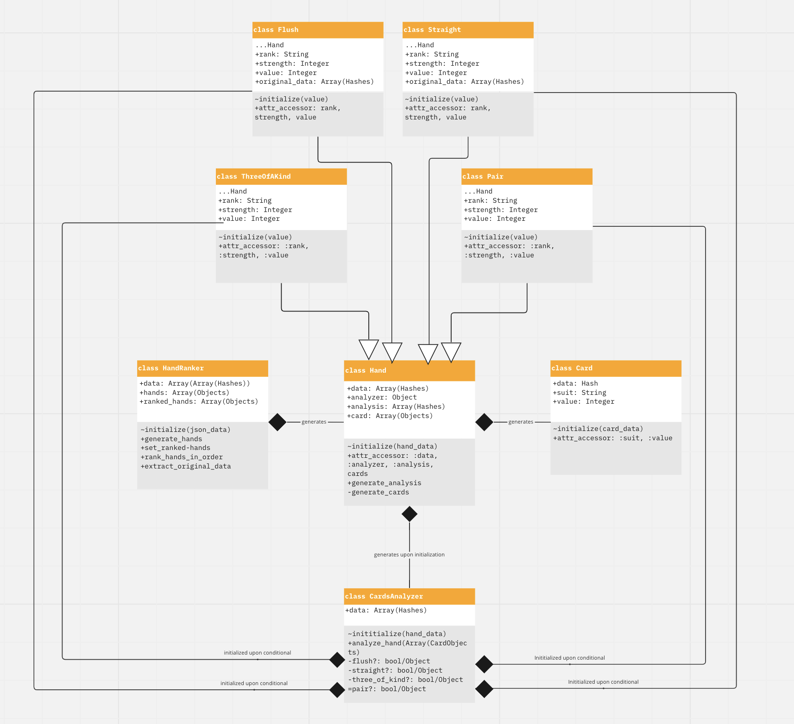

# Poker Tech Test

Poker tech test for Wondr medical. Was glad to see this as I am a consummate, degenerate, gambler.

## My Approach

My approach was gradual and went off without too many issues. Thanks in part to the relentless diagramming and planning in the days leading up to taking the challenge. I'd been unbelievably busy with work throughout the week and assigned myself Thursday day to complete it. My time working in projects in Makers probably taught me most importantly to *diagram everything*. The best teams I participated in and lead would be the ones where we would spend much of the morning talking, planning and diagramming every aspect of the system we planned to create. So I set about first hand drawing my potential classes, attributes, and methods then distilled these thoughts into my first UML diagram. 

My first iteration had utilised key/value hashes in the passing of data from the hand analyzer all the way back up to the HandRanker class. However coming back from lunch I thought my approach lacked few clean OOP examples and unnecessary `add_original_data` methods to pass back errant data. I really wanted to complete the brief in its simplest terms and return the exact same data, only, reordered. So I discerned hashes to be far from Object Oriented. I set about passing the `:rank, :strength, :value` attributes and setting them into the `Hand` class. The Hand object itself started to look bloated with so many attributes.

Consulting the OOP principles, I decided I should give implement Inheritence. I had some experience having done a well reviewed tech test of the [Gilded Rose Kata](https://github.com/archiemartini/Gilded-Rose-Kata). After a couple initial hitches, and all the tests going to pot, I extracted the child classes, `Flush, Straight, ThreeOfAKind and Pair` from the Hand class. This had a dominoe cleaning effect on the entire system:
- Making these after thought `add_original_data` methods disappear, this data was now found within the new Child objects. The HandAnalyzer private functions shortened and now returned these Child functions themselves. 
- The Hand class `initialize` was no longer bloated.
- The hash returns of the analyzer class were replaced with proper, named Child objects of the Hand class.

I believe the programme is as clean as I could get it. Test Coverage is at 99.46%. Do excuse the patchwork mocking, Its been 5 months since I did any proper OOP and mock-testing in Ruby.

Thanks for your consideration, I hope I get a chance to explain my thoughts further in an interview.
-Archie

## Installation

`bundle install` to install dependencies

## Usage

Whilst in the root of the project
```ruby
ruby run.rb
```

Have the `hands.json` open to see the programme do its magic!
The ranked JSON data will be printed in a similar form to the original in the terminal.

## Planning:

UML diagram for class interaction:
https://miro.com/app/board/uXjVPDHJ3wo=/


I initially discerned 4 classes that would comprise a programme that would solve this challenge. 4 child classes of Hand then followed.

## Structure

### `run.rb`
- All the expected user interaction is held in `run.rb`
- I featured every method to show the sequence in which the programme works and its various outputs
- Comment out the final line of `run.rb` to disable writing into the JSON file
```ruby
File.write('./hands.json', JSON.generate(new_json_data, options))
```
### `class PokerHandRanker`
- `generate_cards` evokes an array of Hand Objects into the `@hands` array
- `set_ranked_hands` maps through the `@data` array and calls the Hand Object's 'generate_analysis` method
- `sort_ranked_hands_in_order` calls a sorting algorithm on the `@ranked-hands` array. I added a pair to the original JSON data as proof of the sorting algorithm sorting lower ranked hands below the two three of a kinds. Seriously, tho, check that sort algorithm.
- `extract_original_data` maps through the `@ranked_hands` Object array and accesses the `@data` attribute within them. Returning the data back into the JSON format.
- `print_new_data` puts' the `@ranked_hands` array in a readable format

### `class Hand`
- `generate_analysis` returns reproduced version of the Hand object, under the appropriate child class
- `generate_hands` is called privately by the `get_analysis` method, to populate the `@cards` attribute

### `ChildClasses < Hand`
- I was originally returning hashes (example `{:hand_rank=>"Three of a Kind", :rank_value=>5, :rank_strength=>4}`) containing the analysis information, however, this brought up some issues and required extra methods to insert `original_data` into these hashes.
- Using the principle of inheritence I was able to cut down my lines and increase my readability.
- `@rank` attribute is the given name of the Poker hand
- `@strength` attribute is the strength of a hand where a Royal Flush is `10`, and a High card is `1`, e.g. a Three of a Kind is `4`
- `@value` attribute is the decider in the case of such occurances when it is Three of a Kind vs Three of a Kind, SEE sorting algorithm.

### `class CardsAnalyzer`
- `analyze_cards(cards_object)` calls all the private hand identifying functions with an array of Card Objects in sequence of strength descending inside an id/elsif statement.
- I had already attempted [this Poker kata](https://www.codewars.com/kata/5739174624fc28e188000465) having talked to Frank about this very tech test at the careers fair.
- I was able to recycle the hand identifying methods which cut down on time.
- Not happy about that if/elsif statement but it'll do. Couldn't think of how a cleaner switch/case statement could apply in this context

### `class Card`
- does what it says on the tin
- arguably not necessary, but I feel better about creating objects of them, and accessing those objects is more readable within the CardsAnalyzer class, also allows for `values = cards.map(&:value)`, etc

## Roadmap / Future Implementations / Wants and Desires / Considerations / Dream Board
- Of course, the app, isn't anywhere near to a complete PokerRanking application
  - **Hands Not Included:** would need to be implemented. I have the logic to hand but I didn't want to go too beyond the brief and be a sweat
  - **High Cards, Straights and Flushes:** would require a far different value rating if comparisons got more specific. I'd envisage a sorted Array of the    entire hand's values would have to feature in the object's attributes on the off chance that the comparison of said ranks would happen to match multiple    consecutive values. Say, two hands had King High, then the next highest value would be evaluated, if they matched, then the next, and so on... (flushes    and straights default to the same high card evaluation if matching surface values. Straight Flushes too? No matter how against the odds, hopefully a        single value would solve it.
  - **Ace 1==14 duality** ultimately the programme only accounts for the Ace equalling 1, as the brief stated. However to devleop it further to also rank as the High card generally, and in Straights, etc, I've seen clever methods that evaluate "value distribution" within the hand, these methods will create an array of `1`s and `0`s marking the distribution of a certain value, this sort of method will place a `1` at both `distribution[0]` and `distribution[13]` respectively
- **Final JSON formatting** I was going for style points with that final `File.write` but I COULD NOT for the life of me get that exact formatting, indent was messing me up, got it close as though
- **`attr_accessor` prevalence** It's my assumption that flagrant use of `attr_accessor`s in real life applications would leave the programme open to manipulation
- **Mocking and Stubbing** Again, I really need to work on my mocking and stubbing skills in RSpec. I've been coding in predominately JavaScript/Node.js for the longest time.


